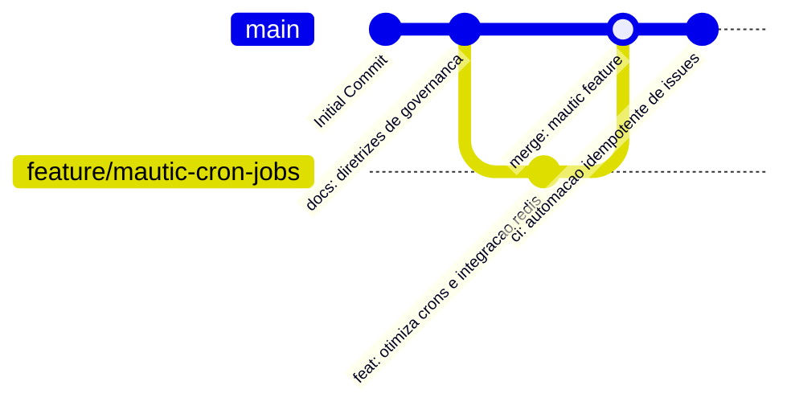

# 📧 BJ Sports Mautic (Automação de Marketing & Governança)

Bem-vindo ao repositório **bjsports-mautic**. Este projeto contém a infraestrutura, scripts de automação, boilerplates de API, prompts de copywriting para campanhas e normas de governança para a automação de marketing da **BJ Sports** utilizando a plataforma **Mautic**.

---

## 🗺️ Mapa Visual de Branches e Fluxo de Governança



---

## 📚 Índice de Documentação e Governança

Abaixo você encontra a estrutura de documentação oficial localizada no diretório [`docs/`](docs/):

| Arquivo | Descrição |
| :--- | :--- |
| [📖 Diretrizes de Documentação](docs/diretrizes_documentacao.md) | Normas editoriais, Modelo Híbrido, automação idempotente e ADRs. |
| [🚀 Estratégia de Execução](docs/estrategia_execucao.md) | Estratégia Git, fluxo de branches e regras de contribuição. |
| [🚚 Guia de Migração & Onboarding](docs/migration_guide.md) | Clonagem, configuração de ambiente e onboarding em novas máquinas. |
| [🛠️ Ajuda & Infraestrutura](docs/ajuda_infra.md) | Arquitetura do Mautic, containers, portas e comandos rápidos. |
| [📋 Postmortem & Lições Aprendidas](docs/postmortem.md) | Registro incremental de incidentes e lições aprendidas. |
| [🔧 Troubleshooting](docs/troubleshooting.md) | Soluções para problemas comuns na execução do Mautic. |
| [💾 Política de Backup](docs/politica_backup.md) | Estratégia de backup 3-2-1 para banco MariaDB e arquivos. |
| [🎯 Plano de Personalização](docs/plano_personalizacao.md) | Roteiro de expansão de réguas de e-mail e webhooks de disparo. |
| [🤖 Prompt de IA Permanência](docs/prompt_ia.md) | Contexto e instruções de sistema para assistentes de IA. |

---

## 📂 Estrutura do Repositório

```text
Mautic-vier/
├── README.md                          # Painel principal (este arquivo)
├── docker-compose.yml                 # Subida do Mautic (Web, MariaDB, Redis)
├── .env.example                       # Modelo de variáveis de ambiente
├── .gitignore                         # Arquivos ignorados pelo Git
├── .github/
│   └── workflows/
│       └── automatizar_issues.yml     # Workflow de automação de Issues idempotente
├── docs/                              # Governança, infraestrutura e sustentação
├── prompts/                           # System prompts para copywriting e campanhas Mautic
├── api/                               # Client Python para consumo da API do Mautic v5
└── infra/                             # Scripts de backup idempotente do MariaDB
```

---

## 🛡️ Segurança por Padrão

- **NUNCA** inclua credenciais reais, tokens de acesso ou arquivos `.env` com dados de produção neste repositório.
- Utilize sempre variáveis de ambiente ou os placeholders indicados (`<MAUTIC_ADMIN_PASSWORD>`, `<MYSQL_PASSWORD>`).
