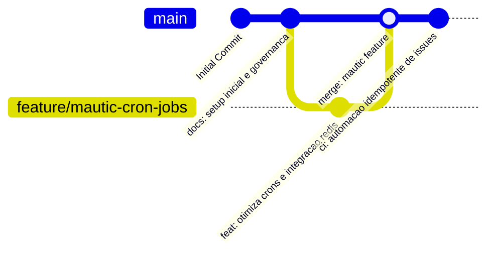

# 🚀 Estratégia de Execução & Git Workflow (Mautic BJ Sports)

Este documento descreve o fluxo de branches, políticas de contribuição e estratégia de versionamento do repositório **bjsports-mautic**.

---

## 🗺️ Fluxo de Branches (GitGraph)



---

## 🛠️ Regras de Contribuição

1. **Branch Principal**: `main` reflete o ambiente estável de produção do Mautic.
2. **Feature Branches**: Devem seguir o padrão `feature/<nome-da-funcionalidade>` ou `fix/<nome-do-bug>`.
3. **Mensagens de Commit**:
   - `feat:` Novas funcionalidades, novos disparadores ou integrações de API.
   - `fix:` Correção de bugs em crons, formulários ou relatórios.
   - `docs:` Alterações na documentação e diretrizes.
   - `ci:` Alterações nos workflows do GitHub Actions.
   - `infra:` Ajustes na stack Docker, MariaDB ou Redis.

---

## 🔄 Fluxo de Deploy & Manutenção do Mautic

1. Copie o `.env.example` para `.env` e preencha os parâmetros.
2. Suba os containers com `docker compose up -d`.
3. Certifique-se de que os cronjobs do Mautic estão rodando ativamente para processar filas de e-mail e atualização de segmentos:
   ```bash
   # Executar atualizações manuais de segmento se necessário
   docker compose exec mautic_web php /var/www/html/bin/console mautic:segments:update
   docker compose exec mautic_web php /var/www/html/bin/console mautic:campaigns:trigger
   ```
